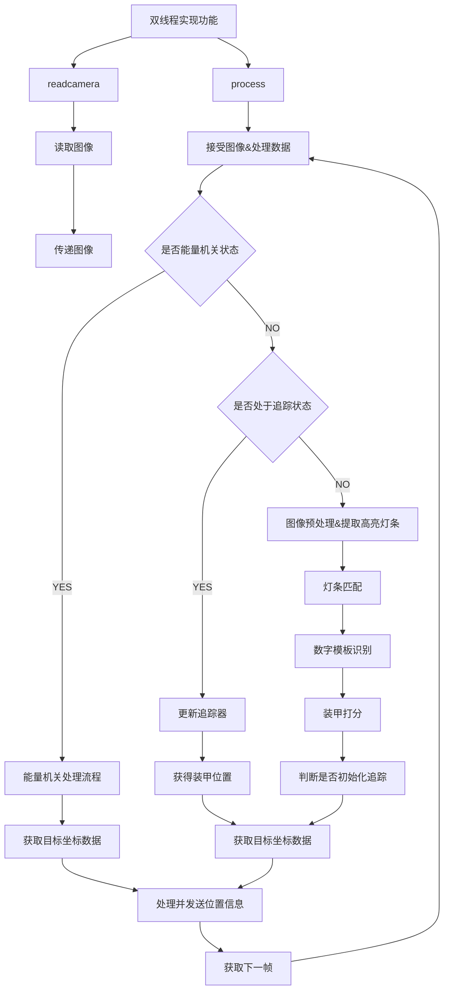

# MUC RM-2020 视觉

## 算法流程图





## 算法流程图(未使用)


```flow
Begin=>start: 接受图像并处理数据
DataRecv=>operation: 接收图像和数据
ifEnergy=>condition: 是否能量机关
EnergyProc=>operation: 能量机关处理流程
EnergyAim=>operation: 获取目标坐标数据
ArmorProc=>operation: 装甲识别处理流程
ifTracking=>condition: 是否处于追踪状态
ImgPreProcess=>operation: 图像预处理，提取高亮灯条
LightBarMatch=>operation: 灯条匹配
NumMatch=>operation: 数字模板识别
ArmorGrading=>operation: 装甲打分
ArmorAim=>operation: 获取目标坐标数据
ifInitTracking=>conditon: 是否满足追踪条件
TrackInit=>operation: 初始化追踪
TrackingUpdate=>operation: 更新追踪器
GetBBox=>operation: 获得装甲位置
SendPostion=>operation: 处理并发送位置信息

GetNextFrame=>condition: 获取下一帧

Begin->DataRecv->ifEnergy
ifEnergy(no)->ArmorProc->ifTracking
ifEnergy(yes)->EnergyProc->EnergyAim
ifTracking(yes)->TrackingUpdate->GetBBox->ArmorAim
ifTracking(no)->ImgPreProcess->ImgPreProcess->LightBarMatch->NumMatch->ArmorGrading->ArmorAim
ArmorAim->SendPostion->GetNextFrame


```

